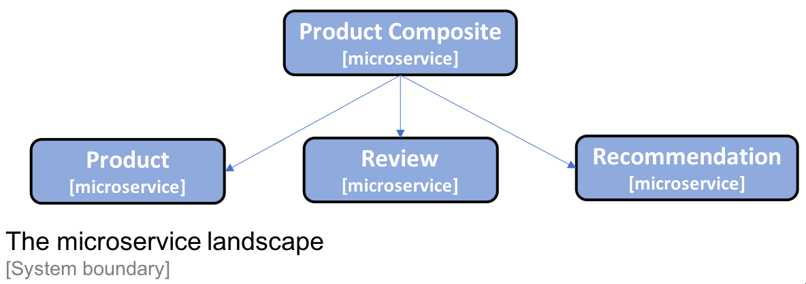
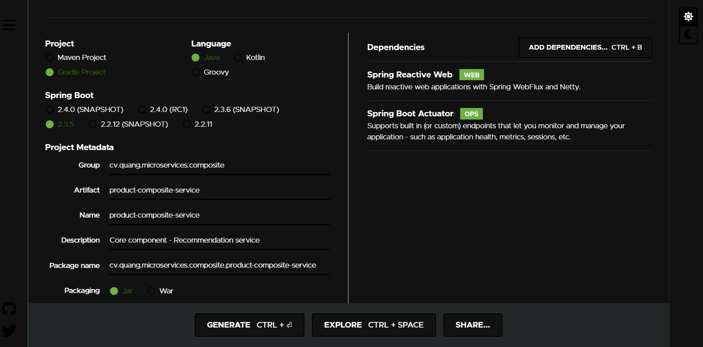

# Microservices with Spring Boot And Spring cloud
This project based on this link: \
[Reference](https://github.com/PacktPublishing/Hands-On-Microservices-with-Spring-Boot-and-Spring-Cloud)

# Set up Spring Boot Application Skeleton
1. Topology landscape
 
2. Create 4 spring boot applications:
- Product-service:7001
- Review-service:7002
- Recommendation-service:7003
- Product-composite-service:7000 \


# Build multiple projects/modules with Gradle
[Reference](https://spring.io/guides/gs/multi-module/)
1. Set up root project with `settings.gradle` and optionally create `build.gradle` empty file to help IDEs to identify the root directory
```markdown
rootProject.name = 'spring'

include 'microservices:product-service'
include 'microservices:review-service'
include 'microservices:recommendation-service'
include 'microservices:product-composite-service'
```
2. Move `gradle` folder and `gradlew*` to `root path` and remove those on each service folder
```shell script
mv microservices/product-service/gradle .
mv microservices/product-service/gradlew* .
rm microservices/product-service/gradlew*
rm -rf microservices/review-service/gradlew*
rm -rf microservices/review-service/gradle
rm -rf microservices/recommendation-service/gradlew*
rm -rf microservices/recommendation-service/gradle
rm -rf microservices/product-composite-service/gradlew*
rm -rf microservices/product-composite-service/gradle
```
3. Build the project from the root directory
```shell script
./gradlew build
```